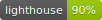

# horimisli.me
 [](https://github.com/horimislime/horimisli.me)  

This repository is the source of https://horimisli.me .

# Building

```
bundle install --path vendor/bundle
make build
```

# License
MIT
